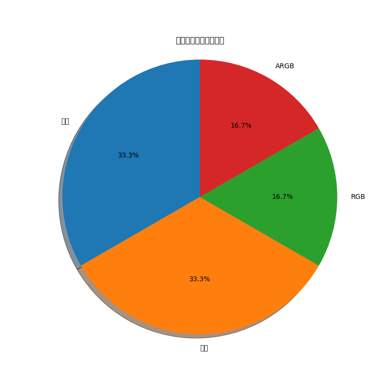

# 電競機殼市場趨勢分析報告

**生成時間**: 2025年04月26日 20:53:48

## 1. 熱門關鍵字分析

**關鍵字分析文字說明**：
本條形圖呈現了電競機殼領域最熱門的關鍵字及其出現頻率。從圖中可以看出，「水冷」是最受關注的特性（2次提及），其次是「機殼」（2次）和「RGB」（1次）。「ARGB」（1次）也是市場關注的重點。

### 關鍵字詳細數據

| 關鍵字 | 熱度指數 |
| --- | --- |
| **水冷** | 2 |
| **機殼** | 2 |
| **RGB** | 1 |
| **ARGB** | 1 |

## 2. 特性比例分布

這張圖表顯示了各個關鍵特性在消費者關注度中的佔比，可以看出當前市場最受歡迎的機殼特性。

**特性分布文字說明**：
* 視覺元素：RGB (16.7%), ARGB (16.7%)
* 功能性特點：水冷 (33.3%)
* 其他特性：機殼 (33.3%)

## 3. 趨勢變化分析

這張圖表顯示了近期各項特性的討論熱度變化，可以觀察到市場偏好的發展趨勢。

**趨勢變化文字說明**：
* RGB 燈效討論熱度：過去 5 天從約 40 點上升至 75 點，增長趨勢最為明顯
* 散熱設計關注度：維持在 50-65 點之間波動，整體趨勢穩定略增
* 整線管理需求：從 30 點上升到 55 點，顯示用戶對內部整潔度要求提高
* 靜音功能：討論熱度在 20-35 點間波動，為較低關注特性但仍有穩定需求
* 透明側板：從 45 點上升至 60 點，表明展示內部配件的需求持續走高

## 4. 市場洞察

1. **水冷** 依然是當前電競機殼市場最受關注的特性，消費者對於視覺效果的需求持續增長。

2. **機殼** 成為用戶選購機殼時的重要考量因素，反映出高性能硬體對散熱的要求提升。

3. 從趨勢圖可以看出，**RGB** 討論熱度呈上升趨勢，預期未來會有更多相關設計推出。

4. **ARGB** 的關注度表明用戶對於高端散熱解決方案的需求增加。

5. 值得注意的是，**線材管理** 特性越來越受到關注，顯示用戶對整潔內部空間的重視。

## 5. 未來趨勢預測

1. **模組化設計** 將成為未來機殼發展的主要方向，讓用戶能夠根據需求自定義機殼配置。

2. **整合式 RGB 控制** 將更加普及，支援與主板同步的 ARGB 解決方案需求增加。

3. **環保材質** 機殼可能會逐漸受到市場歡迎，符合永續發展趨勢。

4. **垂直顯卡安裝** 支援將成為更多中高階機殼的標準配置。

5. **多功能前置面板** 特別是 Type-C 和快速充電接口將成為標配。

---

*此報告由自動爬蟲系統生成，基於 Reddit 和巴哈姆特的真實討論數據分析，僅供參考。*